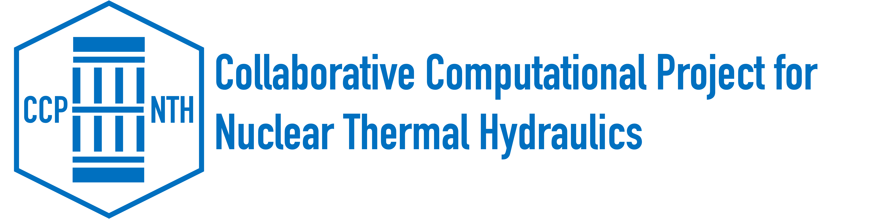

# CHAPSim2 Training Workshop

## Agenda

**Date:** 1st May 2026  
**Venue:** INOX, The University of Sheffield  
**Address:** Level 5, Students' Union Building, Durham Road, Sheffield, S10 2TG  
**Workshop webpage:** https://ccp-nth.github.io/chapsim2-training-workshop/

---

## Programme

### 09:30 – 10:00 | Arrival & Coffee

### 10:00 – 10:15 | Welcome & Overview *(Professor Shuisheng He & ALL)*
- Objectives of the workshop 
- Overview of the workshop structure 
- Participant introductions (background & expectations)

---

### 10:15 – 11:00 | DNS Fundamentals *(Dr. Wei Wang)*
- What DNS resolves 
- Resolution requirements  
- Time stepping and CFL considerations  
- Key diagnostics (mean profiles, statistics)  
- Common pitfalls in DNS  

---

### 11:00 – 12:15 | CHAPSim2 Basics *(Dr. Wei Wang)*
- Overview of CHAPSim2 capabilities and workflow  
- Code structure and workflow  
- Input file (`input_chapsim.ini`) walkthrough  
- Running a case  
  
**Hands-on:**
- Explore a minimal working case  
- Modify a parameter (e.g. Reynolds number, resolution)  
- Run or inspect outputs  

---

### 12:15 – 13:00 | Lunch

---

### 13:00 – 14:00 | Hands-on: Post-processing & Diagnostics
- Visualising results 
- Mean profiles and basic statistics  
- Checking:
  - Mass conservation  
  - Convergence / statistical steady state  
- Identifying and diagnosing issues  

---

### 14:00 – 14:30 | GPU & Performance *(Dr. Bo Liu & Dr. Wei Wang)*
- Porting and running CHAPSim on GPU  
- CPU vs GPU performance considerations  
- Parallel scaling (MPI / decomposition)  
- Practical tips for efficient runs
  
---

### 14:30 – 14:50 | Coffee Break

---

### 14:50 – 15:20 | Invited Talk *(Dr. Jundi He)*
- Comparison of CHAPSim with other CFD/DNS tools
- Strengths, limitations, and application perspectives

---

### 15:20 – 15:50 | Advanced Topics / Open Session *(Dr. Wei Wang)*
- Code modification and extension  
- Thermal flows and additional physics  
- Participant-specific questions

---

### 15:10 – 16:00 | Wrap-up *(Dr. Wei Wang & Professor Shuisheng He)*
- Key takeaways  
- Feedback and discussion  
- Next steps and support  

---

## ⚙️ Preparation Before the Workshop

Participants are expected to bring their own laptops and, if possible, set up CHAPSim2 in advance.

### 1. Clone CHAPSim2

```bash
git clone git@github.com:CCP-NTH/CHAPSim2.git
cd CHAPSim2
```

### 2. Attempt to compile CHAPSim2

This is recommended but not mandatory. We will help troubleshoot installation issues during the workshop, for example at lunch time.

```bash
./build_chapsim.sh
```

You may need a Fortran compiler and MPI installed, such as `gfortran`, OpenMPI, or MPICH.

### 3. Familiarise yourself with basic tools

Please try to familiarise yourself with:

- Basic bash/terminal usage
- Basic plotting tools, such as:
  - Python
  - ParaView

### Note

Reference datasets and post-processing examples will be provided during the workshop.  
There is no need to download large datasets in advance.

---

## 💻 What to Bring

Please bring:

- A laptop with terminal access, such as bash or equivalent
- Python installed, if possible
- Basic plotting or visualisation tools, such as Python, and ParaView
- MPI and compiler setup, if available
- CHAPSim2 installed, if possible
- Optional: your own test cases or research problems for discussion
  
---

## 🎯 Learning Outcomes

By the end of the workshop, you should be able to:

- Understand key DNS concepts relevant to CHAPSim  
- Configure and run a CHAPSim simulation  
- Interpret and analyse simulation outputs  
- Identify and troubleshoot common issues  
